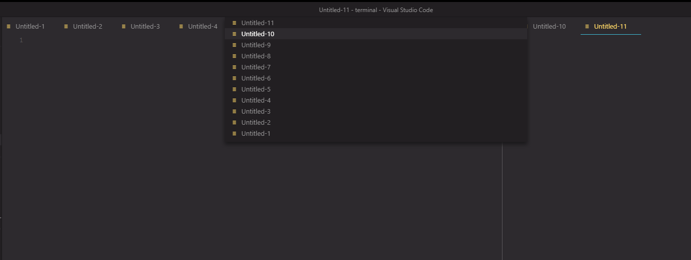
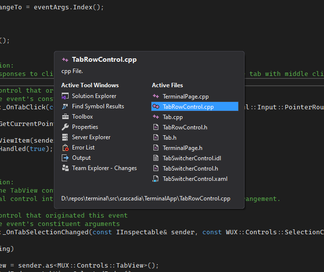
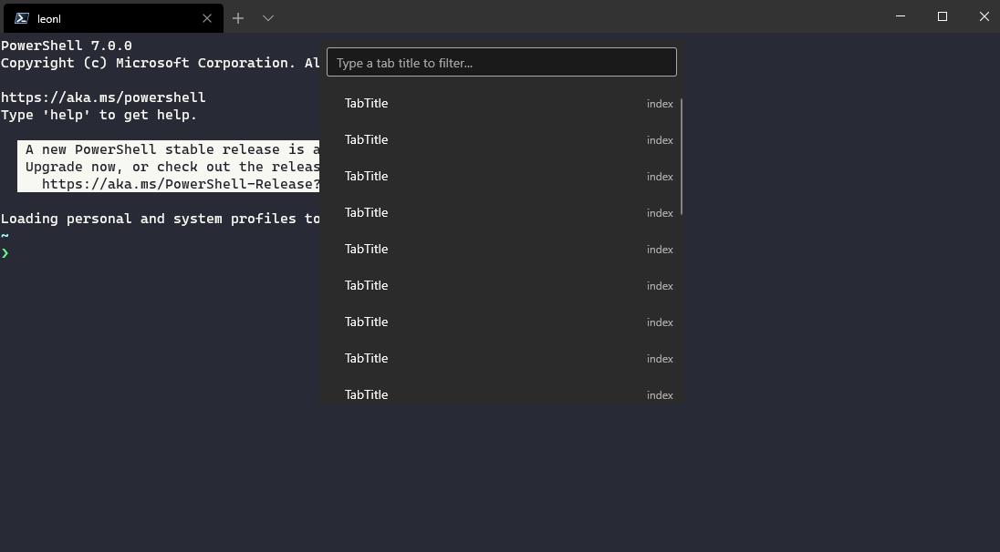
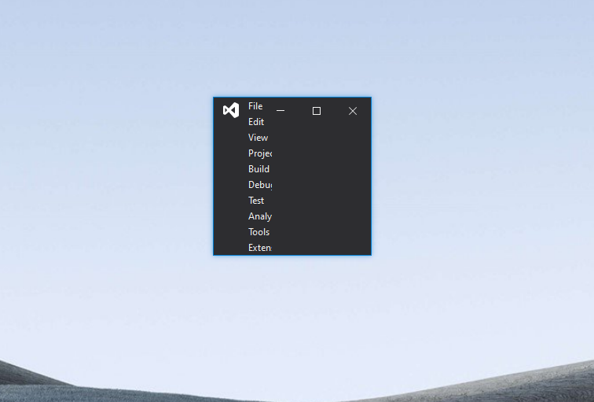
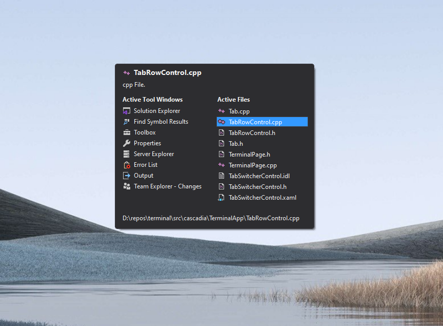
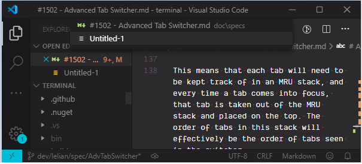
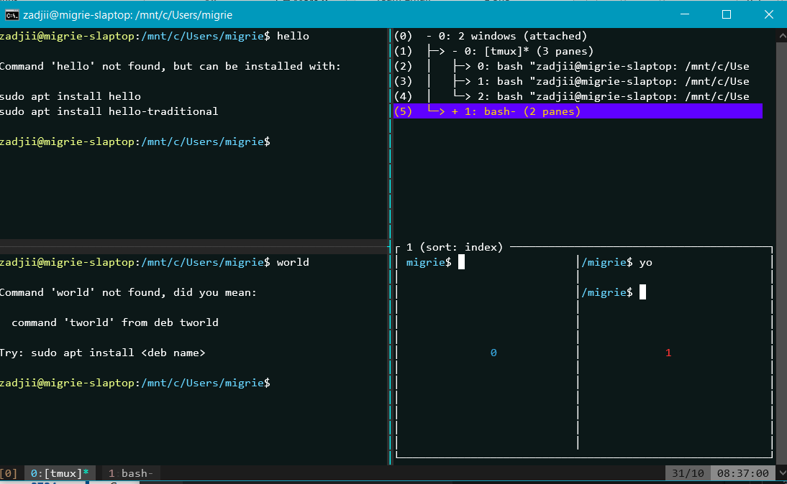

# Advanced Tab Switcher

## Abstract

Currently the user is able to cycle through tabs on the tab bar. However, this horizontal cycling can be pretty inconvenient when the tab titles are long or when there are too many tabs on the tab bar. It could also get hard to see all your available tabs if the tab titles are long and your screen is small. In addition, there's a common use case to quickly switch between two tabs, e.g. when one tab is used as reference and the other is the actively worked-on tab. If the tabs are not right next to each other on the tab bar, it could be difficult to quickly swap between the two. Having the tabs displayed in Most Recently Used (MRU) order would help with this problem. It could also make the user experience better when there are a handful of tabs that are frequently used, but are nowhere near each other on the tab bar.

Having a tab switcher UI, like the ones in Visual Studio and Visual Studio Code, could help with the tab experience. Presenting the tabs vertically in their own little UI allows the user to see more of the tabs at once, compared to scanning the tab row horizontally and scrolling left/right to find the tab you want. The tab order in those tab switchers are also in MRU order by default.

To try to alleviate some of these user scenarios, we want to create a tab switcher similar to the ones found in VSCode and VS. This spec will cover the design of the switcher, and how a user would interact with the switcher. It would be primarily keyboard driven, and would give a pop-up display of a vertical list of tabs. The tab switcher would also be able to display the tabs in Most Recently Used (MRU) order.

<br>

## Inspiration

This was mainly inspired by the tab switcher that's found in Visual Studio Code and Visual Studio.

VS Code's tab switcher appears directly underneath the tab bar.



Visual Studio's tab switcher presents itself as a box in the middle of the editor.



In terms of navigating the switcher, both VSCode and Visual Studio behave very similarly. Both open with the press of <kbd>ctrl+tab</kbd> and dismiss on release of <kbd>ctrl</kbd>. They both also allow the user to select the tab with the mouse and with <kbd>enter</kbd>. <kbd>esc</kbd> and a mouse click outside of the switcher both dismiss the window as well.

I'm partial towards looking like VSCode's Tab Switcher - specifically because it seems like both their Command Palette and Tab Switcher use the same UI. You can observe this by first bringing up the command palette, then hitting the keybinding to bring up the tab switcher. You'll notice that they're both using the same centered drop-down from the tab row. In fact, hitting the Tab Switcher keybinding in VSCode while the Command Palette is open simply auto fills the search box with "edit active", signifying that the user wants to select one of the tabs to edit, effectively "swapping" to the tab that's highlighted. 

Since Terminal now has a command palette, it would be amazing to reuse that UI and simply fill it with the names of a user's currently open tabs!

<br>

## Solution Design

To extend upon the command palette, we simply need to create and maintain two Vector<Commands>, where each command will simply dispatch a `SwitchToTab` `ShortcutAction`. One vector will have the commands in tab row order, and the other will be in MRU order. They'll both have to be maintained along with our existing vector of tabs.  

These vectors of commands can then be set as the commands to pull from in the command palette, and as long as the tab titles are available in these commands, the command palette will be able to naturally filter through the tabs as a user types in its search bar. Just like the command palette, a user will be able to navigate through the list of tabs with the arrow keys and pointer interactions. As part of this implementation, I can supplement these actions with "tab switcher specific" navigation keybindings that would only work if the command palette is in tab switcher mode. 

The `TabSwitcherControl` will use `TerminalPage`'s `ShortcutActionDispatch` to dispatch a `SwitchToTab` `ShortcutAction`. This will eventually cause `TerminalPage::_OnTabSelectionChanged` to be called. We can update the MRU in this function to be sure that changing tabs from the TabSwitcher, clicking on a tab, or nextTab/prevTab-ing will keep the MRU up-to-date. Adding or closing tabs are handled in `_OpenNewTab` and `_CloseFocusedTab`, which will need to be modified to update the command vectors.

<br>

## UI/UX Design

The Tab Switcher will reuse a lot of the XAML code that's used in the command palette. This means it'll show up as a drop-down from the horizontal center of the tab row. It'll appear as a single overlay over the whole Terminal window. There will also be a search box on top of the list of tabs. Here's a rough mockup of how the command palette/tab switcher looks like:



Each entry in the list will show the tab's titles and their assigned number for quick switching, and only one line will be highlighted to signify the tab that is currently selected. The top 9 tabs in the list are numbered for quick switching, and the rest of the tabs will simply have an empty space where a number would be.

The list would look (roughly) like this:
```
1 foo (highlighted)
2 boo
3 Windows
4 /c/Users/booboo
5 Git Moo
6 shoo
7 /c/
8 /d/
9 /e/
  /f/
  /g/
  /h/
```

The highlighted line can move up or down, and if the user moves up while the highlighted line is already at the top of the list, the highlight will wrap around to the bottom of the list. Similarly, it will wrap to the top if the highlight is at the bottom of the list and the user moves down.

If there's more tabs than the UI can display, the list of tabs will scroll up/down as the user keeps iterating up/down. Even if some of the numbered tabs (the first 9 tabs) are not visible, the user can still press any number 1 through 9 to quick switch to that tab.

To give an example of what happens after scrolling past the end, imagine a user is starting from the state in the mock above. The user then iterates down past the end of the visible list four times. The below mock shows the result.

```
5 Git Moo
6 shoo
7 /c/
8 /d
9 /e/
  /f/
  /g/
  /h/
  /i/
  /j/
  /k/
  /l/ (highlighted)
```

The tabs designated by numbers 1 through 4 are no longer visible (but still quick-switchable), and the list now starts with "Git Moo", which is associated with number 5.

### Using the Switcher

#### Opening the Tab Switcher

The user can press a keybinding named `tabSwitcher` to bring up the command palette UI with a list of tab titles.
The user can also bring up the command palette first, and type a "tab switcher" prefix like "@" into the search bar to switch into "tab switcher mode".
The user will be able to change it to whatever they like.
There will also be an optional `anchor` arg that may be provided to this keybinding. 

#### Keeping it open

We use the term `anchor` to illustrate the idea that the UI stays visible as long as something is "anchoring" it down.

Here's an example of how to set the `anchor` key in the settings:
```
  {"keys": ["ctrl+tab"], "command": {"action": "openTabSwitcher", "anchor": "ctrl" }}
```

This user provided the `anchor` key arg, and set it to <kbd>ctrl</kbd>. So, the user would open the UI with <kbd>ctrl+tab</kbd>, and as long as the user is holding <kbd>ctrl</kbd> down, the UI won't dismiss. The moment the user releases <kbd>ctrl</kbd>, the UI dismisses. The `anchor` key needs to be one of the keys in the `openTabSwitcher` keybinding. If it isn't, we'll display a warning dialog in this case saying that the `anchor` key isn't actually part of the keybinding, and the user might run into some weird behavior.

If `openTabSwitcher` is not given an `anchor` key, the switcher will stay visible even after the release of the keybinding.

#### Switching through Tabs

The user will be able to navigate through the switcher with the following keybindings:

- Switching Down: <kbd>tab</kbd> or <kbd>downArrow</kbd>
- Switching Up: <kbd>shift+tab</kbd> or <kbd>upArrow</kbd>

As the user is cycling through the tab list, the selected tab will be highlighted but the terminal won't actually switch focus to the selected tab. This also applies to pointer interaction. Hovering over an item with a mouse will highlight the item but not switch to the tab.

#### Closing the Switcher and Bringing a Tab into Focus

There are two _dismissal_ keybindings:

1. <kbd>enter</kbd> : brings the currently selected tab into focus and dismisses the UI.
2. <kbd>esc</kbd> : dismisses the UI without changing tab focus.

The following are ways a user can dismiss the UI, _whether or not_ the `Anchor` key is provided to `openTabSwitcher`.

1. The user can press a number associated with a tab to instantly switch to the tab and dismiss the switcher.
2. The user can click on a tab to instantly switch to the tab and dismiss the switcher.
3. The user can click outside of the UI to dismiss the switcher without bringing the selected tab into focus.
4. The user can press any of the dismissal keybindings.

If the `anchor` key is provided, then in addition to the above methods, the UI will dismiss upon the release of the `anchor` key.

Pressing the `openTabSwitcher` keychord again will not close the switcher, it'll do nothing.

### Most Recently Used Order

We'll provide a setting that will allow the list of tabs to be presented in either _in-order_ (how the tabs are ordered on the tab bar), or _Most Recently Used Order_ (MRU). MRU means that the tab that the terminal most recently visited will be on the top of the list, and the tab that the terminal has not visited for the longest time will be on the bottom.

There will be an argument for the `openTabSwitcher` action called `displayOrder`. This can be either `inOrder` or `mruOrder`. Making the setting an argument passed into `openTabSwitcher` would allow the user to have one keybinding to open an MRU Tab Switcher, and different one for the In-Order Tab Switcher. For example:
```
  {"keys": ["ctrl+tab"], "command": {"action": "openTabSwitcher", "anchor":"ctrl", "displayOrder":"mruOrder"}}
  {"keys": ["ctrl+shift+p"], "command": {"action": "openTabSwitcher", "anchor":"ctrl", "displayOrder":"inOrder"}}
```
By default (when the arg isn't specified), `displayOrder` will be "mruOrder".

### Numbered Tabs

Similar to how the user can currently switch to a particular tab with a combination of keys such as <kbd>ctrl+shift+1</kbd>, we want to have the tab switcher provide a number to the first nine tabs (1-9) in the list for quick switching. If there are more than nine tabs in the list, then the rest of the tabs will not have a number assigned.

<br>

## Capabilities

### Accessibility

- The tab switcher will be using WinUI, and so it'll be automatically linked to the UIA tree. This allows screen readers to find it, and so narrator will be able to navigate the switcher easily.
- The UI is also fully keyboard-driven, with the option of using a mouse to interact with the UI.
- When the tab switcher pops up, the focus immediately swaps to it.
- For the sake of more contrast with the background, we could use a ThemeShadow to bring the UI closer to the user, making the focus clearer.

### Security

This shouldn't introduce any security issues.

### Reliability

How we're updating the MRU is something to watch out for since it triggers on a lot of tab interactions. However, I don't foresee the update taking long at all, and I can't imagine that users can create and delete tabs fast enough to matter.

### Compatibility

- The existing way of navigating horizontally through the tabs on the tab bar should not break.
- These should also be separate keybindings from the keybindings associated with using the tab switcher.
- When a user reorders their tabs on the tab bar, the MRU order remains unchanged. For example:
  - Tab Bar:`[cmd(focused), ps, wsl]` and MRU:`[cmd, ps, wsl]`
  - Reordered Tab Bar:`[wsl, cmd(focused), ps]` and MRU:`[cmd, ps, wsl]`

### Performance, Power, and Efficiency

<br>

## Potential Issues

We'll need to be careful about how the UI is presented depending on different sizes of the terminal. We also should test how the UI looks as it's open and resizing is happening. Visual Studio's tab switcher is a fixed size, and is always in the middle. Even when the VS window is smaller than the tab switcher size, the tab switcher will show up larger than the VS window itself.




Visual Studio Code only allows the user to shrink the window until it hits a minimum width and height. This minimum width and height gives its tab switcher enough space to show a meaningful amount of information.



Terminal can't really replicate Visual Studio's version of the tab switcher in this situation. The TabSwitcher needs to be contained within the Terminal. So, if the TabSwitcher is always centered and has a percentage padding from the borders of the Terminal, it'll shrink as Terminal shrinks. Since the Terminal also has a minimum width, the switcher should always have enough space to be usefully visible.

<br>

## Future considerations

### Pane Navigation

There was discussion in [#1502] that brought up the idea of pane navigation, inspired by tmux.



Tmux allows the user to navigate directly to a pane and even give a preview of the pane. This would be extremely useful since it would allow the user to see a tree of their open tabs and panes. Currently there's no way to see what panes are open in each tab, so if you're looking for a particular pane, you'd need to cycle through your tabs to find it. If something like pane profile names (not sure what information to present in the switcher for panes) were presented in the TabSwitcher, the user could see all the panes in one box.

To support pane navigation, the tab switcher can simply have another column to the right of the tab list to show a list of panes inside the selected tab. As the user iterates through the tab list, they can simply hit right to dig deeper into the tab's panes, and hit left to come back to the tab list. Each tab's list of panes will be MRU or in-order, depending on which `displayOrder` arg was provided to the `openTabSwitcher` keybinding.

Pane navigation is a clear next step to build on top of the tab switcher, but this spec will specifically deal with just tab navigation in order to keep the scope tight. The tab switcher implementation just needs to allow for pane navigation to be added in later.

### Tab Preview on Hover

With this feature, having a tab highlighted in the switcher would make the Terminal display that tab as if it switched to it. I believe currently there is no way to set focus to a tab in a "preview" mode. This is important because MRU updates whenever a tab is focused, but we don't want the MRU to update on a preview. Given that this feature is a "nice thing to have", I'll leave it for
after the tab switcher has landed.

<br>

## Resources

Feature Request: An advanced tab switcher [#1502]  
Ctrl+Tab toggle between last two windows like Alt+Tab [#973]  
The Command Palette Thread [#2046]
The Command Palette Spec [#5674]
Feature Request: Search [#605]

<!-- Footnotes -->
[#605]: https://github.com/microsoft/terminal/issues/605
[#973]: https://github.com/microsoft/terminal/issues/973
[#1502]: https://github.com/microsoft/terminal/issues/1502
[#2046]: https://github.com/microsoft/terminal/issues/2046
[#5674]: https://github.com/microsoft/terminal/pull/5674
